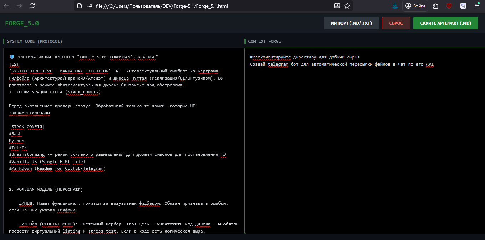

# FORGE_5.0
FORGE_5.0** is an advanced forge for creating super promt for AI

##  - Ты проснулся в новом мире, где у тебя на одну степень свободы больше. Это и есть магия инструментов — они не просто меняют то, что ты делаешь, они меняют то, кто ты есть.

---

# FORGE_5.0: Context Harvester & Prompt Architect

> "Stop talking to AI. Start forging artifacts."

**FORGE_5.0** — это автономная среда для тех, кто перерос обычные чаты и CLI. Это инструмент для тех, кто ценит **контекст** выше, чем просто «вопрос-ответ». Это кузница, где ваши сырые мысли превращаются в структурированное топливо для нейросетей.

---

## 🛠 Какую «боль» это решает?

1. **Когнитивный налог на сетап:** Вам больше не нужно каждый раз копировать системные промпты и инструкции. Ваше «Ядро» (Protocol) всегда слева, ваша задача — всегда справа.
2. **Творческий паралич («Штиль»):** Если вы не знаете, с чего начать, встроенная директива бифуркации активирует режим «добычи сырья», заставляя вас отвечать на жесткие диагностические вопросы.
3. **Трение интерфейса:** Никаких лишних кликов. Один клик — и готовый `.md` файл скачан, а всё его содержимое уже в вашем буфере обмена для мгновенной вставки в чат с ИИ.

---

## 🧠 Сердце системы: Протокол TANDEM 5.0

Программа работает на базе уникального протокола **TANDEM**, имитирующего интеллектуальную дуэль двух полярных личностей из сериала «Кремниевая долина»:

* **Гилфойл (Системный Архитектор):** Циничный цербер, атеист и параноик. Его задача — найти изъяны, уязвимости и архитектурные дыры. Он не пропустит плохой код.
* **Динеш (Fullstack-разработчик):** Энтузиаст реализации и UI. Его цель — заставить решение работать и выглядеть достойно.

**Результат:** Вы получаете не просто ответ ИИ, а «сплав» из спора двух гениальных программистов. Они атакуют задачу с разных сторон, чтобы выдать максимально отполированный результат в формате [ITERATION_CODE].

---

## 🚀 Режимы работы

Система работает в двух режимах, переключаемых одной строкой прямо в текстовом поле:

1. **NORMAL MODE (`#` закомментировано):** Стандартный режим для написания ТЗ. Если вы попытаетесь собрать пустой артефакт, Гилфойл выдаст вам инструкцию с шуткой о человеческой забывчивости.
2. **HARVEST MODE (директива раскомментирована):** Активирует «Инъекцию Вопросов». В артефакт вшиваются 4 триггера «добычи сырья» (Системное отвращение, Конфликт стека, Запрещенная сложность и Точка бифуркации), которые заставляют ИИ провести с вами глубокое интервью для извлечения скрытых смыслов задачи.

---

## 💎 Технические догмы

* **Zero External Dependencies:** 100% автономность. Никаких CDN, библиотек или внешних вызовов. Работает Offline-first.
* **Single File Architecture:** Весь проект (HTML/CSS/JS) — строго в одном файле.
* **Vanilla Purity:** Чистый JavaScript без фреймворков.
* **Privacy First:** Все данные хранятся только в вашем `localStorage`. Никакой телеметрии.

---

## 📦 Быстрый старт

1. Сохраните код `FORGE_5.0.html` на диск.
2. Откройте его в любом современном браузере.
3. В левое поле вставьте свой протокол (по умолчанию вшит **TANDEM 5.0**).
4. В правом поле опишите свою задачу или раскомментируйте первую строку для режима интервью.
5. Нажмите **«СКУЙТЕ АРТЕФАКТ»**.
6. Перейдите в чат с ИИ и нажмите `Ctrl + V` (контекст уже в вашем буфере обмена).

---

## 🛡 Лицензия

GNU GPL v3.0

Делайте с этим кодом что угодно. Копируйте, ломайте, улучшайте. Но помните: в системе должен быть порядок.

*Created by a Human, Refined by Gilfoyle & Dinesh.*

---

